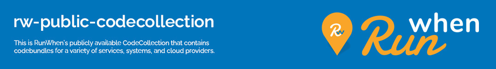

# RunWhen Public Codecollection
This repository is the primary public codecollection that is to be used within the RunWhen platform. It contains codebundles that can be used in SLIs, SLOs, and TaskSets. 

Please see the **[contributing](CONTRIBUTING.md)** and **[code of conduct](CODE_OF_CONDUCT.md)** for details on adding your contributions to this project. 

Documentation for each codebundle is maintained in the README.md alongside the robot code and is published at [https://docs.runwhen.com/public/v/codebundles/](https://docs.runwhen.com/public/v/codebundles/). Please see the [readme howto](README_HOWTO.md) for details on crafting a codebundle readme that can be indexed. 